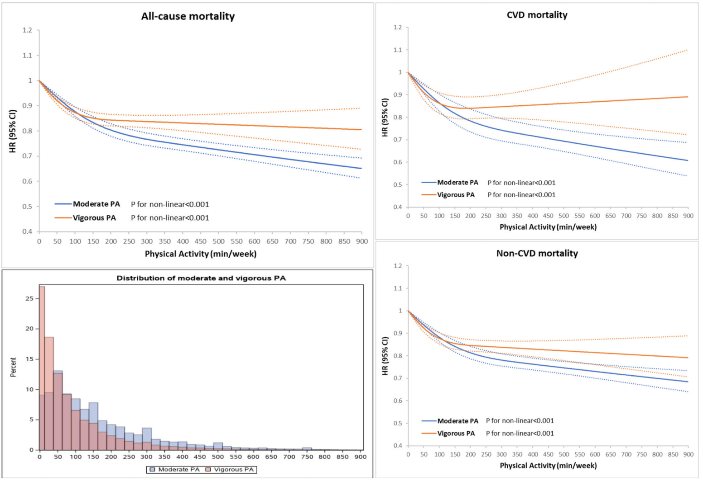

# 第一版锻炼方案

```
v2
created, 2025-05-04T11:01+08:00
published, 2025-05-04T13:58+08:00
category: health
```

[toc]

大家都知道锻炼是非常重要的，每次我在操场上，看到各位小哥哥小姐姐一摇一摆地跑步，心里都非常好奇：大家在锻炼之前，都做过功课吗？那些胖胖的男男女女，真的可以通过锻炼瘦下来吗？今天这篇文章就来分享我自己在锻炼这方面做的功课。

## 基本术语

所有的数据都必须要量化，才能实现最优的效果。
就好像人去做体检一样，是通过血压血糖血脂还有各种指标来反应人的身体健康状况的。
像心率、VO₂max、METs、MPA、VPA、二区、三区、四区等，都是锻炼中常见的术语，我托 [AI](https://yuanbao.tencent.com/bot/app/share/chat/puPqykX1mToj) 撰写了本小节。

-   $VO_2 max$
-   METs(metabolic equivalent of task)
-   MPA(Moderate Physical Activity)
-   VPA(Vigorous Physical Activity)
-   二区
-   三区
-   四区

### VO₂ max（最大摄氧量）

-   定义：人体在极限运动中，每分钟能摄取并利用的最大氧气量，单位为 `ml/(kg·min)`。
-   意义：反映心肺功能、代谢效率和有氧耐力的核心指标。
-   应用：预测寿命、评估心血管健康、指导运动训练。

### METs（代谢当量）

-   定义：以静息代谢率为基准的能量消耗单位，1 MET ≈ 静坐时的能量消耗。
-   应用：量化运动强度（如快走=3.5 METs，跑步=8 METs）。

### MPA（中等强度身体活动）

-   定义：能量消耗为 3-6 METs 的运动，对应最大心率的 60%-70%。
-   特点：可持续对话，以脂肪供能为主，适合长期健康。
-   示例：快走、骑自行车、游泳。

### VPA（剧烈身体活动）

-   定义：能量消耗 >6 METs 的运动，对应最大心率的 80%-90%。
-   特点：呼吸急促，难以完整说话，单位时间燃脂效率是 MPA 的 2 倍。
-   示例：跑步、HIIT、高强度间歇训练。

### 二区（有氧基础区）

-   对应强度：MPA（60%-70% 最大心率）。
-   目标：提升有氧耐力、促进脂肪代谢、增强心肺基础功能。
-   适用场景：日常恢复、减脂、长期健康维护。

### 三区（乳酸阈值区）

-   对应强度：70%-80% 最大心率。
-   特点：乳酸开始积累，但清除速率与生成速率平衡。
-   目标：提升乳酸阈值，增强耐乳酸能力。
-   适用场景：比赛配速训练、节奏跑。

### 四区（无氧耐力区）

-   对应强度：80%-90% 最大心率。
-   特点：糖原供能主导，乳酸快速堆积，无氧代谢为主。
-   目标：突破最大摄氧量（VO₂ max），提升短时爆发力。
-   适用场景：冲刺训练、磷酸原系统强化。

### 乳酸阈值（LT）

-   定义：运动中乳酸开始快速积累的临界点，通常对应 85%-90% 最大摄氧量。
-   意义：决定有氧耐力表现的关键指标，可通过训练延迟阈值出现。

### 极化训练（Polarized Training）

-   原理：将训练量 70%-80% 分配至低强度（二区），20%-30% 分配至高强度（四区），减少中等强度（三区）占比。
-   优势：最大化有氧能力提升，降低过度训练风险。
-   适用人群：进阶运动员、马拉松/铁三选手。

### 恢复与超量恢复

-   恢复：训练后通过休息、营养补充修复肌肉微损伤。
-   超量恢复：身体在恢复后性能超越原有水平，是训练适应的核心机制。
-   关键点：需平衡训练强度与恢复时间，避免疲劳积累。

### 术语对比表

| 术语        | 对应心率区间 | 能量来源            | 核心目标                     |
| ----------- | :----------: | ------------------- | ---------------------------- |
| 二区（MPA） | 60%-70% MHR  | 脂肪 70% + 糖原 30% | 提升有氧基础，降低慢性病风险 |
| 三区（VPA） | 70%-80% MHR  | 脂肪 50% + 糖原 50% | 增强乳酸阈值，提升耐力       |
| 四区（VPA） | 80%-90% MHR  | 糖原 70% + 脂肪 30% | 突破 VO₂ max，提升爆发力     |

## 运动的目的

### 提高 $VO_2 max$

> Cardiorespiratory fitness, as measured by maximal oxygen uptake (VO2max), is related to functional capacity and human performance and has been shown to be a strong and independent predictor of all-cause and disease-specific mortality. [^4]
>
> 心肺适能（以最大摄氧量 VO₂max 衡量）与身体功能能力和运动表现密切相关，并已被证实是全因死亡率和特定疾病死亡率的强独立预测因子。

### 提高肌肉力量

我们应该更关注肌肉力量（strength）而非肌肉质量（mass）

> Although a minority of older US adults met ST recommendations, guideline-concordant ST is significantly associated with decreased overall mortality. All-cause mortality may be significantly reduced through the identification of and engagement in guideline-concordant ST interventions by older adults.[^2]
>
> 尽管只有少数美国老年人达到了力量训练的建议标准，但符合指南的力量训练与总体死亡率降低显著相关。老年人通过识别并参与符合指南的力量训练干预措施，可能会显著降低全因死亡率。

> Muscle strength rather than muscle mass was positively associated with the ability to maintain standing balance in elderly outpatients. Assessment of CoP movement was not of additional value.[^3]
>
> 在老年门诊患者中，与维持站立平衡能力呈正相关的是肌肉力量而非肌肉质量。对压力中心（CoP）移动的评估并无额外价值。

## 运动形式

我还是一个小白，平时只跑跑步，举举哑铃，对于游泳、拉伸、徒步或者其他形式的锻炼所知甚少，所以只能先蜻蜓点水记录一些。

### MPA & VPA 的相关研究

> The nearly maximum association with lower mortality was achieved by performing approximately 150–300 min/week of long-term leisure-time VPA or 300–600 min/week of long-term leisure-time MPA or an equivalent combination of both.[^1]
>
> 通过每周进行约 ​​150–300 分钟长期休闲时间的剧烈身体活动（VPA）​​，或 ​​300–600 分钟长期休闲时间的中等强度身体活动（MPA）​​，或两者的等效组合（如 100 分钟 VPA + 200 分钟 MPA），可达到与降低全因死亡率关联最强的效果。

[^1]

这篇文献也被 Bryan Johnson 的博客引用：

> Our findings suggest that any combinations of medium to high levels of VPA (75–300 min/week) and MPA (150–600 min/week) can provide nearly the maximum mortality reduction (approximately 35–42%).
>
> 我们的研究结果表明，​​ 任何中等到高强度剧烈身体活动（VPA：75-300 分钟/周）与中等强度身体活动（MPA：150-600 分钟/周）的组合 ​​，均可实现接近最大化的死亡率降低效果（约 35%-42%）。

我认为最佳方案是 MPA 和 VPA 结合，毕竟 VPA 可以提高 VO₂max。

### Bryan 的建议[^5]

Exercise 6 hours a week.

-   3 days of strength training
-   3 days of cardio
-   Aim for 150 minutes of moderate activity during which you can maintain a conversation.
-   And 75 minutes of vigorous exercise where you’re unable to converse
-   Include flexibility, balance and mobility exercises.

## 我的最终计划

于我个人而言，今年（2025 年）我 23 岁，最大心率虽然可以使用 `220 - 年龄` 来估计，但是我自己实测（测的时候真是累死我了），我的最大心率为 191。
所以二区心率为 `191 * [0.6, 0.7) = [114.6, 133.7)`，就是 120 左右，这个心率通过慢跑就可以达到。

初步方案（2025-05-04）计划每周锻炼 6 天，留一天休息。

周一为休息日，早上坐地铁去公司，
周二到周五骑自行车去公司，骑车本就是二区训练，周三早点下班，回来举铁。
周六和周日早上去大学跑步(VPA)，下午回来举铁。

骑车或者跑步每次大约 30 min，每周 6 次，达到 3 小时。
力量训练每次大约 40 min，每周 3 次，达到 2 小时。

想要达到每周 6 小时的运动量，真的很难呀。

## 参考

本文参考如下视频再配合自己搜集资料完成：
[My Evidence-Based Workout Plan for Longevity](https://www.youtube.com/watch?v=TZPM-fkD9jo)

Thanks to Bryan Johnson & Siim Land（还有 deepseek🤖

[^1]: [Long-term leisure-time physical activity intensity and all-cause and cause-specific mortality: a prospective cohort of US adults - PMC](https://pmc.ncbi.nlm.nih.gov/articles/PMC9378548/)
[^2]: [Is strength training associated with mortality benefits? A 15year cohort study of US older adults - PubMed](https://pubmed.ncbi.nlm.nih.gov/26921660/)
[^3]: [Muscle strength rather than muscle mass is associated with standing balance in elderly outpatients - PubMed](https://pubmed.ncbi.nlm.nih.gov/23540951/)
[^4]: [Survival of the fittest: VO2max, a key predictor of longevity? - PubMed](https://pubmed.ncbi.nlm.nih.gov/29293447/)
[^5]: [Blueprint Protocol – Blueprint Bryan Johnson](https://blueprint.bryanjohnson.com/pages/blueprint-protocol#exercise)
